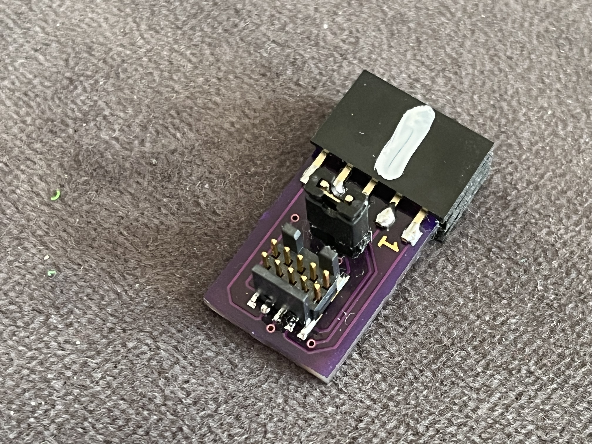
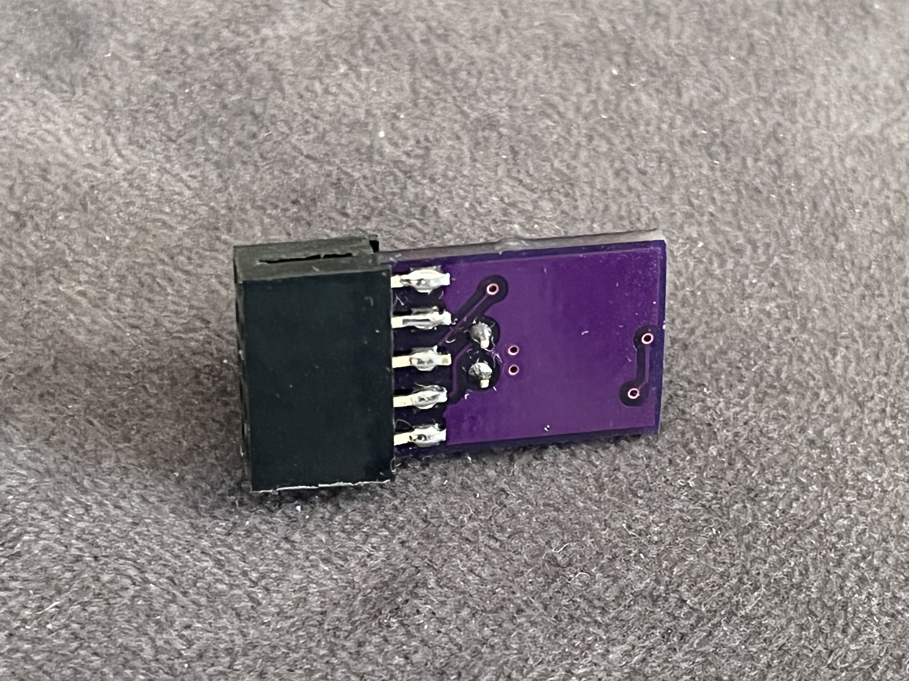
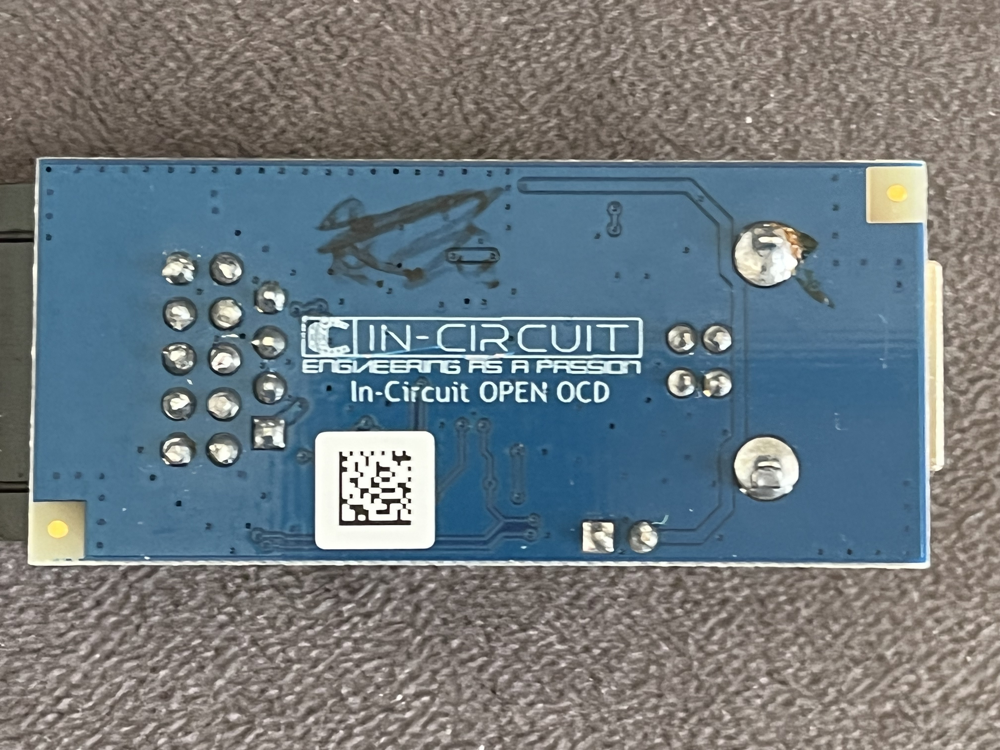
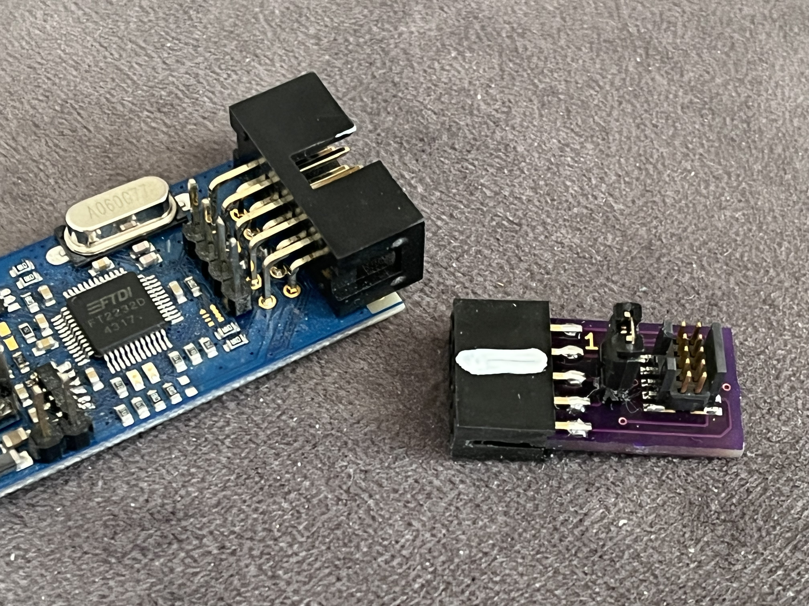
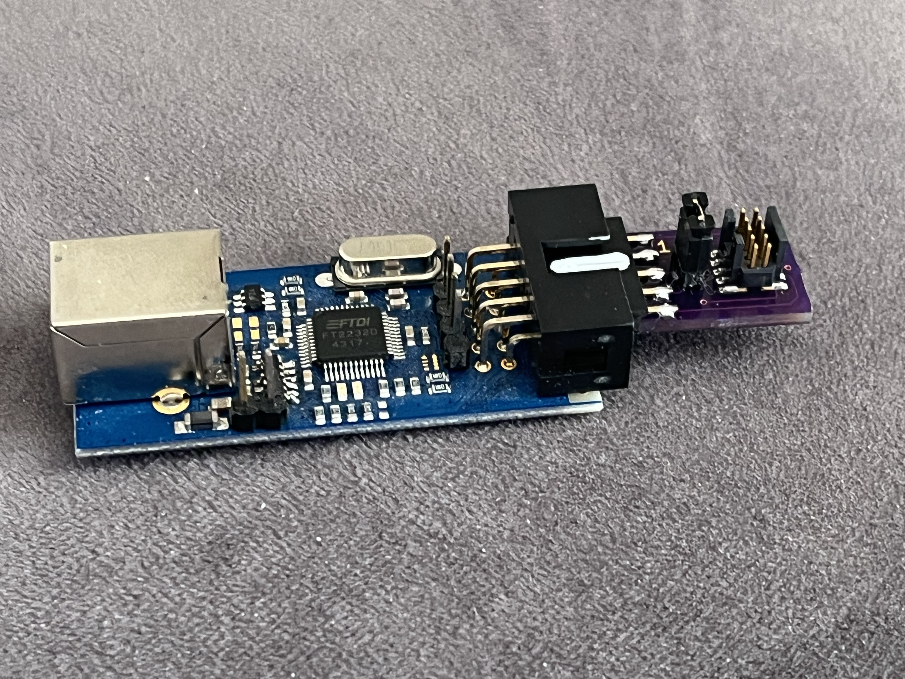
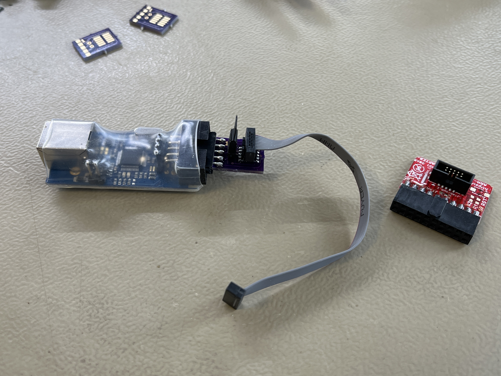

# openOCDmipi10
Adaptor PCB for openOCD debugger to MIPI-10 socket

To be able to use OLIMEX MIPI-10 cables to connect ICprog OpenOCD adaptors to hardware
providing a MIPI-10 connector, the small PCB can be used.

PCBs can be ordered directly from OSH PARK https://oshpark.com/shared_projects/XA7GePBO

Assembly of PCB is easy. For the 10-pin header, cut a longer strip of sockets to 2x5 and
assemble the PCB between the pins.

The MIPI-10 header is of type FTSH-105-XX-X-DV.

